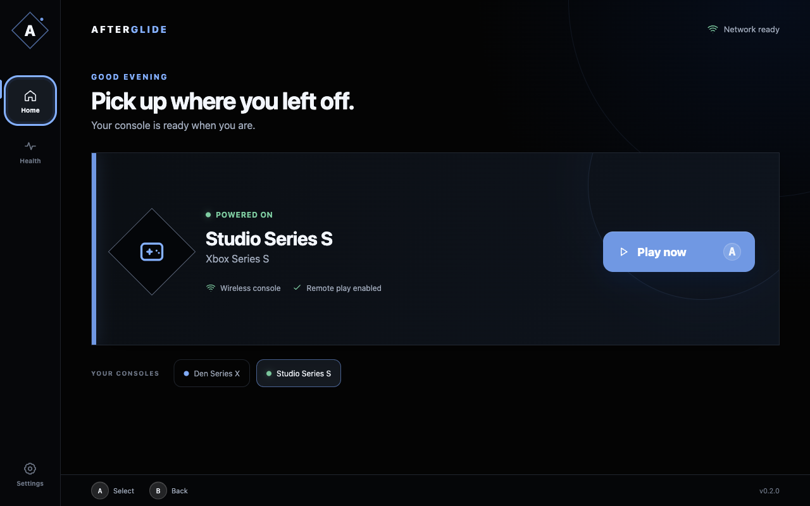

# AFTERGLIDE

**Your Xbox. Wherever you land.**

Afterglide is an open-source, controller-first Xbox streaming client designed
for Steam Deck and desktop computers. The current pre-alpha implements the paths from
Microsoft device-code sign-in through console discovery and xHome remote play,
as well as xCloud library discovery and Xbox Cloud Gaming sessions. Both paths
share WebRTC video/audio, controller input, rumble, telemetry, and recovery UI.

> Afterglide is an independent project. It is not affiliated with or endorsed by
> Microsoft, Xbox, Valve, or Steam.



## What works

- Microsoft device-code authentication in the system browser
- Refresh-token persistence through the operating system encryption service
- Xbox console discovery, selection, and remote wake
- Xbox xHome provisioning and authenticated SDP/ICE signaling
- xCloud entitlement detection, recent games, catalog metadata, and streaming
- H.264 WebRTC video, audio, keepalive, and connection telemetry
- Focused-window gamepad input, full keyboard emulation, and controller rumble
- L3 + R3 access to stream controls with game input paused while they are open
- Controller-first home, setup, settings, diagnostics, error, and recovery flows
- Deterministic Playwright coverage of the real Electron desktop shell

The live protocol is community maintained and can change upstream. A passing
automated suite proves Afterglide's desktop behavior; current service compatibility
still requires a Microsoft account and a live smoke test. Home streaming needs a
remote-play-enabled Xbox; cloud streaming needs an eligible account and region.
Hardware decode and power targets must be measured on the packaged Steam Deck
build before the first supported release.

## Run it

Use Node.js 24 or newer:

```bash
npm ci
npm run dev
```

Sign in from the opening screen, enter the one-time code on Microsoft's site, and
choose a console or open the Cloud library. For home streaming, remote features
must be enabled on Xbox under **Settings → Devices & connections → Remote
features**.

### Steam Input and Deck paddles

Add the Afterglide AppImage to Steam as a non-Steam game and keep Steam's
**Gamepad** template so normal controller input reaches the Xbox. In **Controller
Settings → Edit Layout**, map any spare buttons or rear paddles to these keyboard
keys:

- **L4 → F10** opens and closes Afterglide's controls.
- **R4 → F9** shows and hides performance stats.

Both keys remain local to Afterglide and work even when keyboard game controls
are disabled. In Afterglide's settings, **L3 + R3** keeps the built-in controller
shortcut; **Steam Input** passes that chord through to the Xbox and relies on the
user's F10 binding. Steam's controller configurator supports these keyboard and
XInput mappings through [legacy mode bindings](https://partner.steamgames.com/doc/features/steam_controller/legacy_mode).

Named Afterglide actions in Steam's overlay require a Steam AppID, Steam Input
API integration, and a published action manifest. Those belong to a future Steam
depot; the current AppImage exposes stable legacy bindings without pretending to
have an official Steam configuration.

The renderer never receives Microsoft or Xbox tokens. Afterglide persists a
refresh token only when Electron reports a real OS encryption backend; Linux's
`basic_text` fallback is rejected and leaves the session in memory only.

## Verify it

```bash
npm run verify
npm run test:e2e
npm audit --audit-level=high
```

The end-to-end suite launches Electron at the Steam Deck's 1280×800 viewport,
the 960×600 minimum, and a 1600×1000 desktop viewport. It uses an unpackaged-only
deterministic adapter and covers authentication races, large cloud libraries,
spatial controller navigation, editable keyboard input, connection cancellation,
stream input capture, streaming and recovery, restart persistence, renderer security boundaries,
long-content layout, and automated WCAG checks.

## Build a Linux package

Run this on Linux to produce the Steam Deck artifacts:

```bash
npm run package:linux
```

The output lands in `release/`. AppImage is the current installable format; the
Flatpak gate is documented in [`packaging/flatpak/README.md`](packaging/flatpak/README.md).

## Architecture

```text
React UI + WebRTC + focused controller input
                    │
            sandboxed preload API
                    │
             Electron controller
          ┌─────────┼──────────┐
  Microsoft auth  Smartglass  xHome / xCloud signaling
          └─────────┼──────────┘
              encrypted store
```

See [`docs/ARCHITECTURE.md`](docs/ARCHITECTURE.md),
[`docs/adr/0001-electron-webrtc-desktop.md`](docs/adr/0001-electron-webrtc-desktop.md),
and [`THIRD_PARTY_NOTICES.md`](THIRD_PARTY_NOTICES.md).

## Performance gates

| Measure                         | Release gate                                                       |
| ------------------------------- | ------------------------------------------------------------------ |
| Cold launch to interactive home | Under 2 seconds on Steam Deck                                      |
| Interface rendering             | Sustained 60 fps                                                   |
| Client frame loss               | Under 0.5% in a controlled 30-minute session                       |
| Decode path                     | Hardware acceleration verified in the shipped package              |
| Recovery                        | Resume or explain the failure after sleep and network interruption |

These are release gates rather than current hardware claims. Raw device evidence
will be published with the first beta.

The runtime applies explicit network bounds: 12-second Xbox API timeouts,
idempotent-read retries with exponential backoff, a 4-second ICE gathering
window, candidate and signaling-size caps, a 20-second media connection
deadline, 3-second tolerance for transient WebRTC disconnects, and recovery only
after three consecutive keepalive failures. Afterglide leaves incoming bitrate
adaptation to WebRTC congestion control instead of forcing a fixed bitrate.

## License

MIT. See [`LICENSE`](LICENSE). Xbox protocol behavior is adapted with attribution
from MIT-licensed Greenlight; see the third-party notices.
